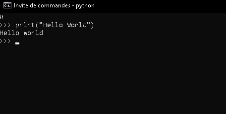
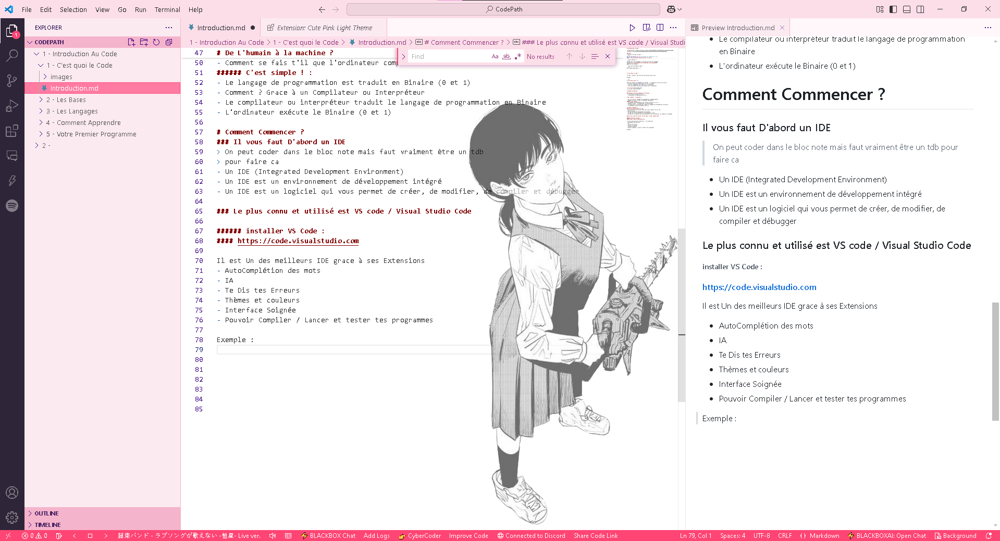
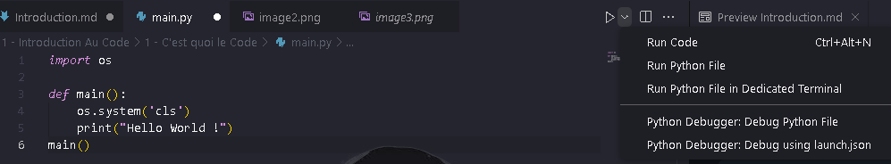
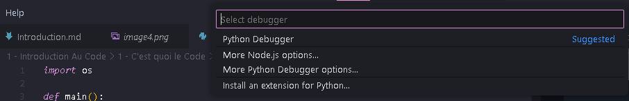

# Introduction au Code


### FAQ :
- Dois-je être Bon en math ? 
```js
Pas du tout besoin, tu as juste besoin de connaitre + - * /
Meme l'affreux matheux Andrea pourrais le faire.
```
- C'est compliqué ?
```py
Pas du tout, Un développeur ne connais pas Tout les langages
Le skill d'un développeur est de chercher ses informations
quand il en a besoin.
```
- C'est quoi exactement coder ?
```py
On y viens juste après ! ^^'
```


# C'est Quoi Le code ?

Le Code / Coding / Dev sont des instructions avant tout.

Exemple : 

```py
print("Hello World !")
``` 
Dans Cet exemple en **Python** on demande à l'ordinateur de faire une action :
- Afficher le message "Hello World !" sur la console.
- C'est un langage qui est compris par l'ordinateur.
- C'est une instruction qui est exécutée par l'ordinateur.


> Et oui C'est juste dans la console Pour le Début (Cmd)


# Comment Ca Marche ?

### Simple en Théorie Compliqué en Pratique
- C'est Grace au Binaire (0 et 1)
- L'ordinateur ne comprends que 0 et 1 

# De L'humain à la machine ?

- On écris dans un langage de Programmation (langage Humain)
- Comment se fais t'il que l'ordinateur comprenne ?
###### C'est simple ! :
- Le langage de programmation est traduit en Binaire (0 et 1)
- Comment ? Grace à un Compilateur ou Interpréteur
- Le compilateur ou interpréteur traduit le langage de programmation en Binaire
- L'ordinateur exécute le Binaire (0 et 1)

# Comment Commencer ?
### Il vous faut D'abord un IDE
> On peut coder dans le bloc note mais faut vraiment être un tdb
> pour faire ca
- Un IDE (Integrated Development Environment)
- Un IDE est un environnement de développement intégré
- Un IDE est un logiciel qui vous permet de créer, de modifier, de compiler et débugger

### Le plus connu et utilisé est VS code / Visual Studio Code

###### installer VS Code :
#### https://code.visualstudio.com

Il est Un des meilleurs IDE grace à ses Extensions
- AutoComplétion des mots
- IA 
- Te Dis tes Erreurs
- Thèmes et couleurs
- Interface Soignée
- Pouvoir Compiler / Lancer et tester tes programmes

Exemple Des Extensions: 
- Activité Discord
- Spotify
- Preview de mon code en Direct
- Thème de grosse egirl
- et bien d'autres !

> (le Dark Mode est présent pas d'inquiètude)

# Le Langage 

### Vous avez besoin d'installer le langage de programmation
> C'est comme si vous aviez besoin d'installer un logiciel
> pour faire fonctionner votre ordinateur
### Le Langage de Programmation est un ensemble de règles et de syntaxe
> qui permettent de créer des programmes
> qui peuvent être exécutés par un ordinateur
### Le Langage de Programmation est utilisé pour créer des programmes
> qui peuvent être utilisés pour résoudre des problèmes
> ou pour créer des applications


# Votre Premier Programme ! ^^

### On commence par Python
- Python est un langage Ultra complet
- Python est facile à apprendre et à utiliser
- Vous pouvez TOUT faire grace aux librairies
- Les librairies sont des "bouts de codes" déja faits et utilisables

### Première Etape, Installer Python !
https://www.python.org/downloads/

Installez La dernière version
# ATTENTION !!

#### Cochez moi bien ces 2 cases sinon c'est la galère

## Lancez VScode
- Faites Un dossier CodePath
- Créez un Dossier Python dans CodePath
- Créez un Fichier main.py
- Ouvrez Le Dossier Python dans VScode

Selectionez le fichier main.py
##### voici le code a écrire (pas de copier coller please)

```py
import os

def main():
    os.system('cls')
    print("Hello World !")
main()
```
-  "import os" Demande a python d'importer la librairie os
- Cette librairie vout permet d'utiliser votre système dans votre code
- (Ouvrir un fichier, un dossier ou même les créer)
> "os.system('cls')" permet de nettoyer la console
- "def" veut dire définir (define en anglais)
- "main" est le nom de la fonction (c'est le nom de votre fonction PRINCIPALE)
-  Ne pas utiliser de majuscule pour les noms de fonctions
- Ne jamais appeler une fonction "main" autre que votre fonction principale
- C'est celle qui "execute" votre code
> print("") est une Fonction déja codée par python
-
> elle permet d'afficher quelque chose dans la console les "" permettent de préciser du texte et non une Variable
- Vous apprendrez les variables sous peu

## Pour lancer le programme :

- cliquez sur Run Code
- Vs Code vous demanderas d'installer une extension pour python
- Installez l'extension pour python
- Recliquez sur run code  
> Vous pouvez Aussi appuyer sur F5



> Cliquez sur Python Debugger


# Devoirs et Exercices Théorique
### Exercice 1 : 
> Tentez d'expliquer pourquoi on apelle la fonction main( ) à la fin du 
code ?

### Exercice 2 : 
> Pourquoi "" ou '' en tant que PARAMETRE de la fonction print() et os.system() ?


